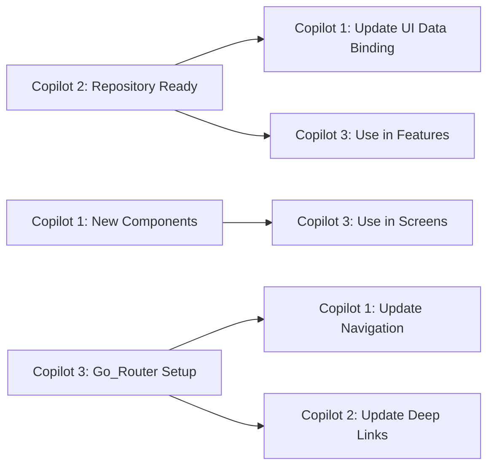

# 🤝 TEAM COORDINATION & COMMUNICATION PROTOCOL
*Essential guidelines for seamless 3-Copilot collaboration*

## 📋 DAILY WORKFLOW

### **Morning Standup (9:00 AM)**
Each Copilot updates their status in `COPILOT_TASK_MANAGEMENT.md`:

```markdown
## 📅 DAILY STATUS - [DATE]

### COPILOT 1 (UI/UX) - [NAME]
- ✅ Completed: [List completed tasks]
- 🔄 In Progress: [Current work]
- 🚧 Blockers: [Any dependencies/issues]
- 📋 Today's Plan: [What you'll work on]

### COPILOT 2 (Backend) - [NAME]  
- ✅ Completed: [List completed tasks]
- 🔄 In Progress: [Current work]
- 🚧 Blockers: [Any dependencies/issues]
- 📋 Today's Plan: [What you'll work on]

### COPILOT 3 (Features) - [NAME]
- ✅ Completed: [List completed tasks]  
- 🔄 In Progress: [Current work]
- 🚧 Blockers: [Any dependencies/issues]
- 📋 Today's Plan: [What you'll work on]
```

---

## 🔄 HANDOFF PROTOCOLS

### **Code Handoffs**
When one Copilot completes work that others depend on:

1. **Update Status**: Mark task as ✅ complete
2. **Document Changes**: Add summary to task file
3. **Test Locally**: Ensure no breaking changes
4. **Notify Team**: Tag relevant Copilots in comments

### **Integration Points**
Key moments requiring coordination:



---

## 📁 FILE OWNERSHIP & RESPONSIBILITY

### **🎨 COPILOT 1 Owns:**
```
lib/widgets/
lib/theme/
assets/images/
lib/core/utils/size_helper.dart
lib/core/utils/image_constant.dart
```

### **⚡ COPILOT 2 Owns:**
```
lib/core/services/
lib/data/
lib/providers/
lib/core/error/
pubspec.yaml (dependencies)
```

### **🚀 COPILOT 3 Owns:**
```
lib/routing/
lib/presentation/*/screens/ (new ones)
test/
integration_test/
lib/core/navigation/
```

### **🤝 Shared Ownership:**
```
lib/presentation/*/notifier/ (coordinate changes)
lib/presentation/*/models/ (enhance together)
lib/routes/app_routes.dart (migration together)
```

---

## 🚨 CONFLICT RESOLUTION

### **When Editing Same File:**
1. **Communicate First**: Post in task management before editing
2. **Small Commits**: Make frequent, focused commits
3. **Pull Often**: Update your branch regularly
4. **Resolve Fast**: Address conflicts immediately

### **Blocking Dependencies:**
```
Priority Order:
1. Backend Repository Setup (Copilot 2)
2. Go_Router Migration (Copilot 3)  
3. UI Component Enhancements (Copilot 1)
```

---

## 📊 PROGRESS TRACKING

### **Weekly Milestones:**
```
Week 1: Foundation
- [ ] Repository pattern implemented
- [ ] Go_Router migrated
- [ ] UI components enhanced

Week 2: Integration  
- [ ] API integration complete
- [ ] Feature screens implemented
- [ ] Real data flowing

Week 3: Polish
- [ ] Error handling complete
- [ ] Testing implemented
- [ ] Performance optimized
```

### **Daily Metrics:**
Each Copilot tracks in their task file:
- **Lines of Code**: Added/Modified
- **Files Changed**: Count and purpose
- **Tests Added**: Unit/Widget/Integration
- **Bugs Fixed**: Issues resolved

---

## 💬 COMMUNICATION CHANNELS

### **Urgent Issues (Same Day Response):**
- Critical bugs blocking other Copilots
- Breaking changes that affect integration
- Major architectural decisions needed

### **Regular Updates (Next Day Response):**
- Task completion notifications
- Code review requests
- Question about implementation approach

### **Planning Items (Weekly Discussion):**
- New feature prioritization
- Architecture evolution
- Performance optimization strategies

---

## 🧪 TESTING STRATEGY

### **Individual Testing:**
Each Copilot tests their own work:
```dart
// Copilot 1: Widget Tests
testWidgets('CustomAppBar displays username correctly');

// Copilot 2: Unit Tests  
test('UserRepository returns correct data');

// Copilot 3: Integration Tests
testWidgets('Navigation flows work correctly');
```

### **Cross-Team Testing:**
Weekly integration testing sessions:
- **Monday**: Backend + UI integration
- **Wednesday**: Features + Backend integration  
- **Friday**: Full app testing

---

## 📋 CODE REVIEW PROCESS

### **Review Requirements:**
- **Copilot 1**: Reviews UI/UX and theme changes
- **Copilot 2**: Reviews data layer and state management
- **Copilot 3**: Reviews navigation and feature logic

### **Review Checklist:**
```markdown
- [ ] Code follows project conventions
- [ ] No breaking changes introduced
- [ ] Tests included for new functionality
- [ ] Documentation updated if needed
- [ ] Performance impact considered
```

---

## 🔧 DEVELOPMENT ENVIRONMENT

### **Required Extensions:**
- Flutter/Dart extensions
- GitLens for collaboration
- Error Lens for quick debugging
- Flutter Widget Inspector

### **Shared Configurations:**
```json
// .vscode/settings.json
{
  "dart.flutterSdkPath": "path/to/flutter",
  "dart.lineLength": 80,
  "editor.formatOnSave": true,
  "editor.codeActionsOnSave": {
    "source.fixAll": true
  }
}
```

---

## 📚 KNOWLEDGE SHARING

### **Documentation Standards:**
Each major implementation includes:
```dart
/**
 * [ClassName] - Brief description
 * 
 * Purpose: Why this exists
 * Usage: How to use it
 * Dependencies: What it relies on
 * 
 * @author Copilot [Number]
 * @created [Date]
 * @lastModified [Date]
 */
```

### **Learning Resources:**
- **Flutter Best Practices**: Share interesting findings
- **Performance Tips**: Document optimization techniques
- **Common Patterns**: Create reusable code examples

---

## 🎯 SUCCESS METRICS

### **Team Performance:**
- **Velocity**: Tasks completed per day
- **Quality**: Bugs introduced per feature
- **Collaboration**: Smooth handoffs and integration
- **User Experience**: App usability and performance

### **Individual Excellence:**
- **Code Quality**: Lint score and review feedback
- **Testing**: Coverage percentage and test quality
- **Documentation**: Clarity and completeness
- **Innovation**: Creative solutions and improvements

---

## 🏆 TEAM GOALS

### **Short Term (1 Week):**
- Seamless collaboration established
- Core functionality working
- No major blocking issues

### **Medium Term (2-3 Weeks):**
- Production-ready app
- Full feature set implemented
- Performance optimized

### **Long Term (1 Month):**
- App store ready
- Comprehensive testing
- Scalable architecture

---

**Together we build excellence! Let's make this the best Flutter app development experience! 🚀**

**Team Start Date**: September 8, 2025  
**Next Review**: September 9, 2025 - 9:00 AM
